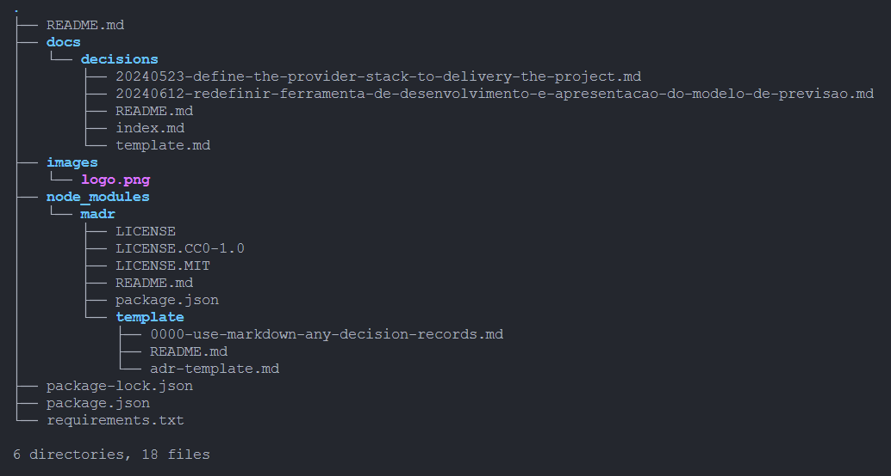

# Tech Mack Crazy - Sales Predicton
 

 
## Visão Geral
O projeto proposto pelos professores do curso de MBA em Engenharia de Dados da Universidade Mackenzie consiste em criar um processo completo de ingestão, transformação e análise de dados de vendas, resultando na criação de um modelo de previsão de vendas e um dashboard interativo.
Como parte do processo de desenvolvimento, criamos um repositório para controlar as decisões de arquitetura através de um template de ADR e o [log4brains](https://github.com/thomvaill/log4brains) para gerenciar e visualizar as ADRs

Neste outro [repositório](https://github.com/techmackcrazy/dbt-mack-sales-prediction) contém toda a estrutura técnica do projeto.
 
## Configuração do Ambiente
 
### Pré-requisitos
Certifique-se de ter as seguintes ferramentas instaladas:
- Python 3.8+
- Apache Airflow
- dbt
- log4brains
 
### Passo a Passo
 
1. **Clone o Repositório**
``` bash
git clone https://github.com/usuario/projeto-de-dados.git
cd projeto-de-dados
```

2. **Configuração do log4brains**
 
   - Para utilizar o log4brains será necessário a instalação do npm (Node Package Manager) que é o gerenciador de pacotes padrão para o ambiente de execução JavaScript Node.js. Ele permite que os desenvolvedores instalem, compartilhem e gerenciem bibliotecas e ferramentas JavaScript.
 
3. Execute os comandos abaixo na pasta principal do projeto

``` bash
npm install -g log4brains
log4brains init
```

4. **Inicialize o servidor local do log4brains**
   - Execute o comando a seguir para inicializar o servidor local

``` bash
log4brains preview
```

5. **Crie uma ADR**
``` bash
log4brains adr new
```

O projeto terá a seguinte estrutura:



---

Para saber mais sobre o log4brains, acesso o repositório oficial do [thomvaill](https://github.com/thomvaill/log4brains)
